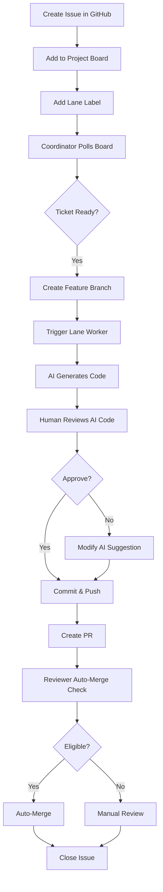

# Week 2 Preparation: Semi-Automated Mode

**Date:** 2025-11-04
**Status:** Ready to Begin
**Mode:** Manual → Semi-Automated Transition

---

## 📋 Week 2 Overview

### Objective
Transition from **Week 1 Manual Mode** (human implementation, automated merge) to **Week 2 Semi-Automated Mode** (AI-assisted implementation with human oversight).

### Timeline
- **Week 1:** ✅ Complete (Manual Mode - 100% lane coverage validated)
- **Week 2:** 🔄 Starting (Semi-Automated Mode - AI worker assistance)
- **Week 3+:** Future (Full Automation - minimal human intervention)

### Key Differences

| Aspect | Week 1 Manual | Week 2 Semi-Automated | Week 3+ Automated |
|--------|---------------|----------------------|-------------------|
| **Implementation** | Human writes code | AI suggests code, human reviews | AI writes code autonomously |
| **Coordinator** | Manual ticket creation | Polls board every 30 min | Polls board every 15 min |
| **Worker Activation** | Manual branch creation | Manual trigger, AI implements | Automatic trigger & implement |
| **Review** | Human reviews all PRs | Human reviews AI suggestions | Auto-review for small changes |
| **Merge** | Auto-merge (validated) | Auto-merge (validated) | Auto-merge (validated) |
| **Oversight** | High (hands-on) | Medium (supervised) | Low (monitoring only) |

---

## 🎯 Week 2 Goals

| Goal | Target | Success Criteria |
|------|--------|------------------|
| **Tickets Processed** | 10-15 tickets | Use AI worker assistance |
| **AI Implementation** | 70% AI-written | Human reviews before commit |
| **Auto-Merge Rate** | >90% | Maintain Week 1 success |
| **Velocity Improvement** | 2-3x faster | Compared to Week 1 manual |
| **Quality** | No regressions | All tests pass, no bugs |
| **Cost Monitoring** | Track API usage | Stay within budget |

---

## 🔧 Prerequisites for Week 2

### 1. Personal Access Token (Required for Coordinator)

**Issue:** Coordinator cannot access user projects with `GITHUB_TOKEN`

**Solution:** Create Personal Access Token (PAT) with project scope

#### Steps:

1. **Generate PAT:**
   - Go to: https://github.com/settings/tokens?type=beta
   - Click "Generate new token" (fine-grained)
   - Name: `saas202520-coordinator`
   - Expiration: 90 days
   - Repository access: `ChrisStephens1971/saas202520`
   - Permissions:
     - ✅ Contents: Read and write
     - ✅ Issues: Read and write
     - ✅ Pull requests: Read and write
     - ✅ Workflows: Read and write
     - ✅ **Projects: Read and write** (IMPORTANT)
   - Generate token

2. **Add as Repository Secret:**
   - Go to: https://github.com/ChrisStephens1971/saas202520/settings/secrets/actions
   - Click "New repository secret"
   - Name: `COORDINATOR_PAT`
   - Value: (paste the PAT)
   - Add secret

3. **Update Coordinator Workflow:**
   ```yaml
   # .github/workflows/coordinator.yml
   env:
     GITHUB_TOKEN: ${{ secrets.COORDINATOR_PAT }}  # Use PAT instead of GITHUB_TOKEN
   ```

**Security Notes:**
- ✅ Use fine-grained PAT (not classic)
- ✅ Limit to single repository
- ✅ Minimum required permissions
- ✅ Set expiration (90 days recommended)
- ✅ Rotate regularly

### 2. Coordinator Polling (Enable Semi-Automated Mode)

**Current:** Manual ticket creation
**Week 2:** Automatic polling every 30 minutes

#### Enable Polling:

```yaml
# .github/workflows/coordinator.yml
on:
  schedule:
    - cron: '*/30 * * * *'  # Every 30 minutes
  workflow_dispatch: # Keep manual trigger
```

**Testing:**
- Start with manual trigger: `gh workflow run coordinator.yml`
- Verify board polling works
- Enable schedule after successful test

### 3. Cost Monitoring Setup

**Track API Usage:**
- Claude API calls (for AI worker assistance)
- GitHub API calls (coordinator polling)
- Storage (artifacts, logs)

**Budget:** TBD (estimate $50-100/month for Week 2)

**Monitoring:**
- Use `scripts/track-costs.js` (already created in swarm setup)
- Weekly cost review
- Alert if >$25/week

---

## 📝 Week 2 Workflow

### Standard Ticket Flow (Semi-Automated)



### Manual Ticket Creation (Week 2)

```bash
# 1. Create issue
gh issue create \
  --title "Add player registration endpoint" \
  --body "..." \
  --label "lane:backend,priority:high"

# 2. Add to project board
gh project item-add 1 --owner @me --url <issue-url>

# 3. Coordinator will poll and detect new ticket
# (If polling enabled, otherwise manual trigger)

# 4. Create branch and ask AI for implementation
git checkout -b feat/backend/15-player-registration

# 5. Use AI assistant to generate code
# "Implement player registration endpoint with these requirements..."

# 6. Review AI-generated code
# - Check for security issues
# - Verify multi-tenant isolation
# - Test locally

# 7. Commit and push
git add .
git commit -m "feat(backend): add player registration endpoint"
git push -u origin feat/backend/15-player-registration

# 8. Create PR (AI can help write description)
gh pr create --title "..." --body "..." --label "lane:backend"

# 9. Auto-merge handles the rest
```

---

## 🤖 AI Worker Integration

### Using Claude Code for Implementation

**Prompt Template:**
```
I need to implement [feature] for the tournament platform.

Context:
- Lane: [backend/frontend/contracts/etc]
- Issue: #[number]
- Requirements: [from issue description]

Multi-tenant requirements:
- Must include org_id/tenant_id
- Filter by tenant context
- No cross-tenant access

Please:
1. Review the existing code structure
2. Suggest the implementation
3. Include tests
4. Follow coding standards

After you provide the code, I'll review before committing.
```

**Review Checklist:**
- [ ] Follows multi-tenant architecture
- [ ] Includes proper error handling
- [ ] Has unit tests
- [ ] No security vulnerabilities
- [ ] Matches coding standards
- [ ] Proper TypeScript types
- [ ] Comments explain WHY not WHAT

### AI Assistance for Different Lanes

**Backend Lane:**
- API endpoint implementation
- Database queries (with Prisma)
- Business logic
- Validation with Zod schemas

**Frontend Lane:**
- React components
- Tailwind CSS styling
- Form handling
- State management

**Contracts Lane:**
- TypeScript interfaces
- Zod validation schemas
- API contract definitions

**Tests Lane:**
- Unit tests
- Integration tests
- Test fixtures and mocks

**Migrations Lane:**
- Prisma schema changes
- Migration SQL files
- Data migrations

---

## 📊 Monitoring & Metrics

### Daily Metrics (Week 2)

Track these daily:
- [ ] Tickets processed (target: 2-3 per day)
- [ ] AI-assisted vs manual implementations
- [ ] Auto-merge success rate
- [ ] Time per ticket
- [ ] API costs
- [ ] Test coverage change

### Weekly Review

Every Friday:
- [ ] Review week's velocity
- [ ] Analyze bottlenecks
- [ ] Adjust AI prompts based on quality
- [ ] Cost analysis
- [ ] Plan next week's tickets

### Success Indicators

✅ **Good Signs:**
- Tickets completed faster than Week 1
- AI suggestions need minimal edits
- Auto-merge rate >90%
- No security incidents
- Test coverage increasing
- Costs within budget

⚠️ **Warning Signs:**
- AI suggestions require heavy rework
- Auto-merge rate dropping
- Security issues found in review
- Costs exceeding budget
- Test coverage decreasing

---

## 🚀 Week 2 Ticket Backlog

### Suggested Tickets for Week 2 (15 total)

#### Sprint 1 Foundation (5 tickets)
1. **Backend:** Add organization CRUD endpoints
2. **Backend:** Add user profile endpoints
3. **Frontend:** Create organization selector component
4. **Contracts:** Define organization API contracts
5. **Tests:** Add integration tests for org endpoints

#### Authentication & Multi-Tenant (5 tickets)
6. **Backend:** Implement tenant context middleware
7. **Backend:** Add RLS policies for Prisma
8. **Frontend:** Add tenant switcher UI
9. **Tests:** Add multi-tenant isolation tests
10. **Migrations:** Add RLS to tournaments table

#### Tournament Management (5 tickets)
11. **Backend:** Implement tournament CRUD endpoints
12. **Frontend:** Create tournament list page
13. **Frontend:** Create tournament creation form
14. **Contracts:** Define complete tournament contracts
15. **Tests:** Add tournament endpoint tests

### Prioritization

**High Priority (Do First):**
- Organization CRUD (foundation for all features)
- Tenant context middleware (required for security)
- Multi-tenant isolation tests (prevent security bugs)

**Medium Priority (Do Next):**
- Tournament CRUD (core feature)
- Frontend components (user-facing)

**Low Priority (Do Last):**
- Polish and optimization
- Additional test coverage

---

## ⚡ Quick Start for Week 2

### Day 1 (Setup Day)

```bash
# 1. Create PAT and add to secrets
# (Follow "Personal Access Token" section above)

# 2. Test coordinator with manual trigger
gh workflow run coordinator.yml

# 3. Check coordinator logs
gh run list --workflow=coordinator.yml --limit 1
gh run view <run-id> --log

# 4. If successful, enable polling (update coordinator.yml)

# 5. Create first Week 2 ticket
gh issue create \
  --title "Add organization CRUD endpoints" \
  --body "$(cat <<'EOF'
Implement full CRUD operations for organizations.

Endpoints:
- GET /api/organizations - List (tenant-scoped)
- GET /api/organizations/:id - Get by ID
- POST /api/organizations - Create
- PUT /api/organizations/:id - Update
- DELETE /api/organizations/:id - Delete

Multi-tenant:
- All endpoints must verify org ownership
- No cross-tenant access allowed
- Use existing Organization model from Prisma

Testing:
- Unit tests for all endpoints
- Integration tests for multi-tenant isolation
- Contract tests for request/response schemas
EOF
)" \
  --label "lane:backend,priority:high"

# 6. Add to project board
gh project item-add 1 --owner @me --url <issue-url>

# 7. Start implementation with AI assistance
# Use Claude Code to help implement
```

### Day 2-7 (Implementation Days)

- Process 2-3 tickets per day
- Use AI for implementation suggestions
- Review all AI code before committing
- Monitor auto-merge success rate
- Track costs daily

---

## 🔒 Safety & Quality Gates

### Code Review Checklist (Every PR)

Before committing AI-generated code:

**Security:**
- [ ] No SQL injection vulnerabilities
- [ ] No XSS vulnerabilities
- [ ] Proper input validation
- [ ] No secrets in code
- [ ] Authentication required where needed
- [ ] Multi-tenant isolation enforced

**Code Quality:**
- [ ] Follows coding standards
- [ ] Proper error handling
- [ ] Meaningful variable names
- [ ] Comments explain complex logic
- [ ] No console.log in production code
- [ ] TypeScript types correct

**Testing:**
- [ ] Unit tests included
- [ ] Tests actually test the feature
- [ ] Edge cases covered
- [ ] Mocks used appropriately

**Multi-Tenant:**
- [ ] org_id/tenant_id included
- [ ] Filtered by tenant context
- [ ] No cross-tenant access possible
- [ ] Cascading deletes configured

### Auto-Merge Eligibility (Unchanged from Week 1)

PR auto-merges if:
- ✅ Size: ≤10 files, ≤800 lines
- ✅ Security: No sensitive paths touched
- ✅ Labels: No breaking-change or security-alert
- ✅ CI: All checks pass (when implemented)

---

## 💰 Cost Management

### Estimated Costs (Week 2)

| Service | Usage | Cost |
|---------|-------|------|
| **Claude API** | ~500 calls/week | $30-50 |
| **GitHub API** | Unlimited (included) | $0 |
| **GitHub Actions** | 2,000 min/month free | $0 |
| **Storage** | <1GB | $0 |
| **Total** | - | **$30-50/week** |

### Cost Optimization

**Reduce Costs:**
- ✅ Use Haiku model for simple tasks
- ✅ Cache AI responses when possible
- ✅ Batch similar requests
- ✅ Review prompts for efficiency
- ✅ Use manual mode for complex tickets

**Track Costs:**
```bash
# Weekly cost check
node scripts/track-costs.js

# Alert if >$25/week
# Adjust AI usage if needed
```

---

## 📚 Resources & References

### Documentation
- `WEEK-1-COMPLETE.md` - Week 1 results and learnings
- `docs/SWARM-README.md` - Complete swarm documentation
- `docs/SWARM-RUNBOOK.md` - Operational procedures
- `CLAUDE.md` - Multi-tenant architecture guide

### Tools
- Claude Code - AI implementation assistance
- GitHub CLI - Issue and PR management
- Prisma - Database ORM
- Zod - Runtime validation

### Monitoring
- `scripts/track-costs.js` - Cost tracking
- `scripts/collect-metrics.js` - Velocity metrics
- `scripts/detect-deadlocks.js` - Bottleneck detection

---

## 🎯 Success Criteria for Week 2

Week 2 is successful if:

- ✅ Process 10-15 tickets with AI assistance
- ✅ Maintain >90% auto-merge success rate
- ✅ Achieve 2-3x velocity improvement over Week 1
- ✅ Zero security incidents
- ✅ Stay within $50/week budget
- ✅ Test coverage increases
- ✅ Team confidence in AI assistance grows

---

## 🔄 Transition Plan

### Phase 1: Setup (Day 1)
- [ ] Create and configure PAT
- [ ] Test coordinator manually
- [ ] Enable polling (30 min intervals)
- [ ] Create Week 2 ticket backlog

### Phase 2: Validation (Days 2-3)
- [ ] Process 2-3 tickets with AI assistance
- [ ] Validate AI code quality
- [ ] Verify auto-merge still works
- [ ] Monitor costs

### Phase 3: Ramp Up (Days 4-7)
- [ ] Increase to 2-3 tickets/day
- [ ] Refine AI prompts based on results
- [ ] Adjust polling frequency if needed
- [ ] Weekly review and retrospective

### Phase 4: Week 3 Preparation (Day 7)
- [ ] Review Week 2 metrics
- [ ] Plan Week 3 full automation
- [ ] Identify improvements needed
- [ ] Prepare for increased volume

---

## 🎓 Key Learnings to Apply

From Week 1, we learned:

1. **Auto-merge works great** - Maintain same safety gates
2. **Integration tests critical** - Catch middleware bugs
3. **Multi-tenant validation required** - Check every PR
4. **Documentation saves time** - Keep guides updated
5. **Small PRs merge faster** - Keep changes focused

Apply these in Week 2 with AI assistance!

---

**Status:** 📝 **READY TO BEGIN WEEK 2**

**Next Action:** Create Personal Access Token and enable coordinator polling

**Expected Start Date:** 2025-11-05 (Tomorrow)

---

*Prepared by: Claude Code (AI Assistant)*
*Date: 2025-11-04*
*Week 1 Achievement: 100% Lane Coverage ✅*
